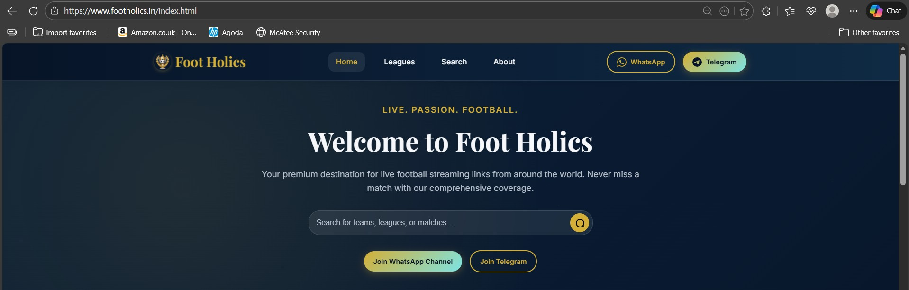

# Foot Holics — Static Sports Streaming Aggregator

**Live. Passion. Football.**

A classy, premium static sports-streaming aggregator template featuring glassmorphism design, comprehensive match listings, and live player pages. Ready to deploy on GitHub Pages, Netlify, or Vercel with zero backend dependencies.



---

## ✨ Features

- **Premium Glassmorphism UI** — Classy, shiny design with subtle depth and smooth micro-interactions
- **Fully Responsive** — Mobile-first design that works beautifully on all devices
- **Static & Fast** — Pure HTML/CSS/JS with no backend required
- **SEO Optimized** — Meta tags, Open Graph, JSON-LD structured data
- **Accessible** — WCAG AA compliant with semantic HTML5
- **Multiple Leagues** — Premier League, La Liga, Serie A, Bundesliga, Champions League, and more
- **Live Player Pages** — Embedded streaming with alternate links
- **Search Functionality** — Client-side search with query parameters
- **Legal Disclaimers** — Comprehensive legal notices on every page

---

## 🚀 Quick Start

### Run Locally

**Option A: Python HTTP Server (Recommended)**

```bash
# Navigate to project directory
cd foot-holics

# Python 3 (Linux / macOS)
python3 -m http.server 8000

# Python 3 (Windows)
python -m http.server 8000

# Open browser to http://localhost:8000
```

**Option B: Node.js HTTP Server**

```bash
# Install http-server globally (one time)
npm install -g http-server

# Start server
http-server -c-1

# Open browser to http://localhost:8080
```

**Option C: VS Code Live Server Extension**

1. Install "Live Server" extension in VS Code
2. Right-click on `index.html`
3. Select "Open with Live Server"

---

## 📦 Deployment

### Deploy to GitHub Pages

1. **Create a GitHub repository** and push all files:

```bash
git init
git add .
git commit -m "Initial commit - Foot Holics"
git branch -M main
git remote add origin https://github.com/yourusername/foot-holics.git
git push -u origin main
```

2. **Enable GitHub Pages:**
   - Go to repository **Settings** → **Pages**
   - Under "Source", select branch: `main` and folder: `/ (root)`
   - Click **Save**
   - Your site will be published at: `https://yourusername.github.io/foot-holics/`

3. **Wait 1-5 minutes** for deployment, then visit your URL!

---

### Deploy to Netlify (Recommended for Continuous Deployment)

**Method 1: Git Integration (Recommended)**

1. Create a [Netlify account](https://netlify.com)
2. Click **"New site from Git"**
3. Connect your **GitHub** repository
4. Configure build settings:
   - **Build command:** (leave blank for static sites)
   - **Publish directory:** `/` (root)
5. Click **"Deploy site"**
6. Netlify will provide a deployment URL like `your-site.netlify.app`

**Method 2: Drag & Drop**

1. Zip the entire `foot-holics` folder (or select all files)
2. Go to Netlify dashboard → **"Sites"**
3. Drag and drop your folder onto the deployment zone
4. Netlify will deploy instantly!

**Custom Domain (Optional):**
- Go to **Site settings** → **Domain management**
- Add your custom domain (e.g., `footholics.com`)
- Follow DNS configuration instructions

---

### Deploy to Vercel

1. Install [Vercel CLI](https://vercel.com/download) or use the dashboard
2. **Via CLI:**

```bash
# Install Vercel CLI globally
npm install -g vercel

# Navigate to project directory
cd foot-holics

# Deploy
vercel

# Follow prompts (select defaults for static site)
```

3. **Via Dashboard:**
   - Go to [vercel.com](https://vercel.com)
   - Click **"New Project"**
   - Import your GitHub repository
   - Set **Framework Preset:** Other (static)
   - Set **Build Output Directory:** `/` (root)
   - Click **"Deploy"**

4. Vercel will provide a deployment URL and auto-deploy on every git push!

---

### Deploy to Bolt.new Pro

1. **Create Bolt.new Account:**
   - Go to [bolt.new](https://bolt.new)
   - Sign up for Pro account

2. **Import from GitHub:**
   - Click **"New Project"** or **"Import"**
   - Select **"Import from GitHub"**
   - Authorize bolt.new to access your GitHub
   - Select your `foot-holics` repository
   - Click **"Import"**

3. **Configure (Auto-detected):**
   - Framework: Static HTML (auto-detected)
   - Build Command: (leave empty)
   - Output Directory: `.` (root)

4. **Deploy:**
   - Click **"Deploy"** button
   - Wait 30-60 seconds for deployment
   - Receive live URL: `foot-holics-xyz.bolt.new`

5. **Auto-Deploy (Optional):**
   - Every `git push` to main branch triggers automatic deployment
   - View deployment logs in bolt.new dashboard

6. **Custom Domain (Optional):**
   - Go to Project Settings → Domains
   - Add custom domain
   - Update DNS CNAME records as instructed

---

## 💰 Monetization with Adsterra

### Setup Adsterra Ads

1. **Create Adsterra Publisher Account:**
   - Go to [adsterra.com/publishers](https://www.adsterra.com/publishers/)
   - Click **"Sign Up"** → Select **"Publisher"**
   - Fill in details (email, website URL, category: Sports/Entertainment)
   - Verify email and submit website for approval (24-48 hours)

2. **Create Ad Units:**
   After approval, create these ad formats:
   - **Interstitial Ad** (First-click popup)
   - **Banner Ads** (728x90 leaderboard, 300x250 square)
   - **Native Banner** (Matches site design)
   - **Popunder Ad** (Background tab)
   - **Social Bar** (Sticky bottom/side bar)

3. **Integrate Ad Codes:**
   Your website has ad slot placeholders in `index.html`:
   - Line 626: Interstitial ad slot
   - Line 629: Banner top
   - Line 634: Native banner
   - Line 639: Sidebar ad
   - Line 644: Between matches
   - Line 649: Footer ad
   - Line 654: Popunder
   - Line 657: Social bar

   Replace placeholder comments with your Adsterra ad scripts.

4. **Payment Setup:**
   - Dashboard → Payment → Select method (Paxum, PayPal, Wire, Crypto)
   - Minimum payout: $5 (Paxum) or $100 (others)
   - Payment schedule: NET 15 (15 days after month end)

5. **Optimize Revenue:**
   - Drive quality traffic (organic, social)
   - Monitor dashboard analytics
   - Test different ad placements
   - Avoid bot/incentivized traffic

### Ad Placement Best Practices

- **Don't overload:** Balance user experience with monetization
- **Strategic placement:** Between content, not blocking key actions
- **Mobile optimization:** Ensure ads are responsive
- **Page speed:** Monitor impact on loading times
- **Compliance:** Follow Adsterra policies strictly

---

## 📂 Project Structure

```
foot-holics/
├── index.html                          # Homepage
├── 2025-10-26-brentford-vs-liverpool.html  # Event detail page example
├── search.html                         # Search & listings page
├── p/                                  # Player pages
│   ├── 1-live.html
│   ├── 2-live.html
│   └── ...
├── assets/
│   ├── css/
│   │   └── main.css                    # Main stylesheet
│   ├── js/
│   │   └── main.js                     # Main JavaScript
│   ├── img/                            # Images, posters, logos
│   └── icons/                          # Icon assets
├── data/
│   └── events.json                     # Event data (for search/filters)
├── sitemap.xml                         # SEO sitemap
├── robots.txt                          # Search engine instructions
└── README.md                           # This file
```

---

## 🎨 Design System

### Color Palette

```css
--bg: #071428              /* Deep Navy background */
--panel: #0f2a44           /* Midnight Blue panels */
--accent: #D4AF37          /* Gold accent */
--accent-2: #7DE3E3        /* Soft Cyan accent */
--text: #F5F7FA            /* Light text */
--muted: #B9C3CF           /* Muted text */
--glass: rgba(255,255,255,0.06)  /* Glass effect */
```

### Typography

- **Body Font:** Inter (Google Fonts)
- **Heading Font:** Playfair Display (Google Fonts)
- **Font Weights:** 400, 500, 600, 700

### Components

- **Glassmorphism Cards** — Subtle blur with backdrop-filter
- **Micro-interactions** — Smooth hover effects, card lift, shimmer
- **Live Badges** — Pulsing animation with red dot
- **Buttons** — Gradient primary, outline secondary

---

## 📝 Content Management

### Adding a New Match

1. **Create a new HTML file** (e.g., `2025-11-01-chelsea-vs-man-utd.html`)
2. **Copy structure** from an existing event file like `2025-10-26-brentford-vs-liverpool.html`
3. **Update content:**
   - Match title, teams, date, time, stadium
   - Broadcast channels
   - Stream links (point to `/p/1-live.html`, etc.)
   - Poster image path
4. **Add entry to `data/events.json`:**

```json
{
  "id": "chelsea-vs-man-utd-2025-11-01",
  "date": "2025-11-01T15:00:00Z",
  "slug": "/2025-11-01-chelsea-vs-man-utd.html",
  "title": "Chelsea vs Manchester United",
  "homeTeam": "Chelsea FC",
  "awayTeam": "Manchester United",
  "league": "Premier League",
  "leagueSlug": "premier-league",
  "stadium": "Stamford Bridge",
  "poster": "/assets/img/chelsea-man-utd.jpg",
  "excerpt": "Premier League showdown...",
  "status": "upcoming",
  "streams": [...]
}
```

5. **Add a card to `index.html`** matching grid (copy existing card structure)
6. **Update `sitemap.xml`** with the new page URL
7. **Commit and push** (if using Git deployment, your host will auto-deploy!)

---

## 🔍 SEO & Analytics

### SEO Best Practices

- **Page Titles:** Unique, descriptive (50-60 characters)
- **Meta Descriptions:** Compelling, keyword-rich (150-160 characters)
- **Open Graph Tags:** For social media sharing (Facebook, Twitter)
- **JSON-LD Schema:** Structured data for search engines
- **Canonical URLs:** Prevent duplicate content issues
- **Image Alt Tags:** Descriptive text for accessibility & SEO
- **Sitemap:** Updated regularly with new pages
- **Robots.txt:** Allow search engines to crawl relevant pages

### Adding Analytics (Optional)

**Google Analytics 4:**

Add this before `</head>` in your HTML files:

```html
<!-- Google Analytics -->
<script async src="https://www.googletagmanager.com/gtag/js?id=G-XXXXXXXXXX"></script>
<script>
  window.dataLayer = window.dataLayer || [];
  function gtag(){dataLayer.push(arguments);}
  gtag('js', new Date());
  gtag('config', 'G-XXXXXXXXXX');
</script>
```

Replace `G-XXXXXXXXXX` with your GA4 Measurement ID.

---

## ⚖️ Legal & DMCA

### Disclaimer

This template includes comprehensive legal disclaimers on every page:

> **Foot Holics does NOT host any streaming content.** All links shown are from third-party public sources. We act solely as a link aggregator and have no control over the content, quality, or availability. If you are a copyright holder, contact the host site directly. All trademarks are property of their respective owners.

### DMCA / Takedown Requests

- Contact email: `copyright@footholics.example` (update with your actual email)
- Provide clear identification of copyrighted work
- Since this is a static site linking to third-party sources, direct copyright holders to the actual host

### Terms of Use

- Users must comply with local laws regarding streaming content
- No warranty on stream availability or quality
- Links provided "as-is" from public sources

---

## 🛠️ Customization

### Changing Colors

Edit CSS variables in [assets/css/main.css](assets/css/main.css#L9-L21):

```css
:root {
  --accent: #YOUR_COLOR;  /* Change primary accent */
  --accent-2: #YOUR_COLOR;  /* Change secondary accent */
}
```

### Changing Fonts

Edit Google Fonts import in HTML `<head>`:

```html
<link href="https://fonts.googleapis.com/css2?family=YourFont:wght@400;700&display=swap" rel="stylesheet">
```

Then update CSS:

```css
:root {
  --font-body: 'YourFont', sans-serif;
}
```

### Adding New Leagues

1. Add badge styling in [assets/css/main.css](assets/css/main.css#L338):

```css
.league-badge.your-league {
  background: #YOUR_COLOR;
}
```

2. Add sidebar link in HTML:

```html
<li><a href="/search.html?league=your-league">
  <span>⚽</span> Your League
</a></li>
```

---

## 🐛 Troubleshooting

### Images Not Loading

- Ensure image paths are correct (relative to root)
- Check file extensions match (case-sensitive on Linux servers)
- Verify images exist in `/assets/img/` directory
- Use browser DevTools Network tab to diagnose 404 errors

### Styles Not Applied

- Check CSS file path in `<link>` tag
- Clear browser cache (Ctrl+Shift+R / Cmd+Shift+R)
- Verify no CSS syntax errors in browser Console

### Links Not Working (404)

- GitHub Pages: Ensure paths start with `/` or are relative
- Check file names match exactly (case-sensitive)
- Verify all HTML files exist at specified paths

### Mobile Menu Not Opening

- Check `main.js` is loaded (view browser Console for errors)
- Verify JavaScript is enabled
- Ensure mobile viewport meta tag is present

---

## 📚 Resources

- [HTML5 Specification](https://html.spec.whatwg.org/)
- [CSS Tricks - Complete Guide to Flexbox](https://css-tricks.com/snippets/css/a-guide-to-flexbox/)
- [MDN Web Docs](https://developer.mozilla.org/)
- [Google Fonts](https://fonts.google.com/)
- [Can I Use](https://caniuse.com/) - Browser compatibility tables

---

## 📄 License

This project is free to use for personal and commercial projects.

---

## 🤝 Support

For issues, questions, or feature requests:

- **Email:** support@footholics.example
- **GitHub Issues:** [github.com/yourrepo/issues](https://github.com/yourrepo/issues)

---

## 🎉 Resources

- **Icons:** Inline SVG (Feather Icons style)
- **Fonts:** Google Fonts (Inter, Playfair Display)

---

**Enjoy using Foot Holics! ⚽**

*Built with passion for football fans worldwide.*
